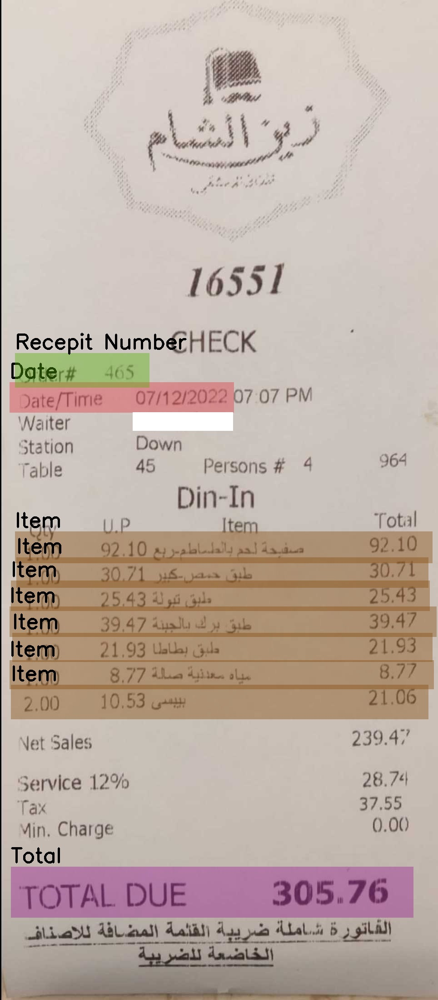
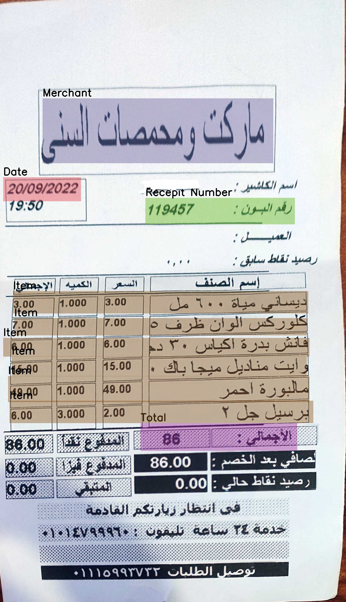
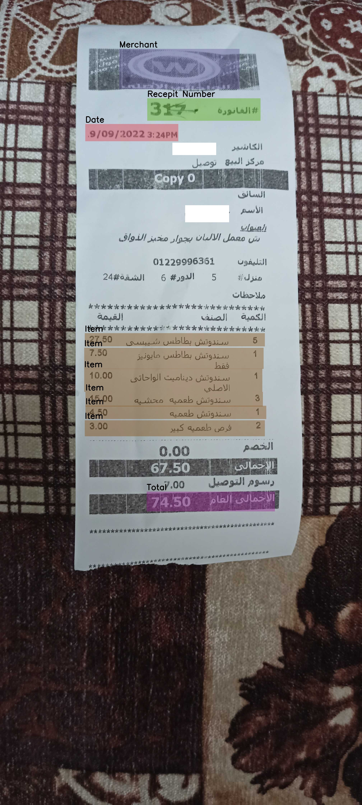
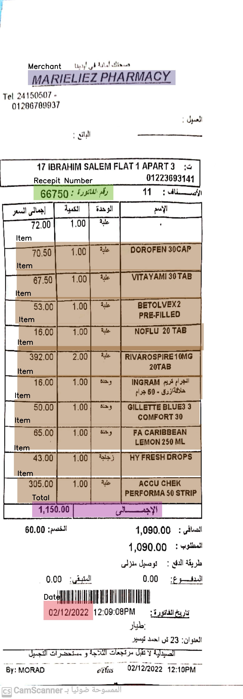

## [CORU: Comprehensive Post-OCR Parsing and Receipt Understanding Dataset]()

In the fields of Optical Character Recognition (OCR) and Natural Language Processing (NLP), integrating multilingual capabilities remains a critical challenge, especially when considering languages with complex scripts such as Arabic. This paper introduces the Comprehensive Post-OCR Parsing and Receipt Understanding Dataset (CORU), a novel dataset specifically designed to enhance OCR and information extraction from receipts in multilingual contexts involving Arabic and English. CORU consists of over 20,000 annotated receipts from diverse retail settings in Egypt, including supermarkets and clothing stores, alongside 30,000 annotated images for OCR that were utilized to recognize each detected line, and 10,000 items annotated for detailed information extraction. These annotations capture essential details such as merchant names, item descriptions, total prices, receipt numbers, and dates. They are structured to support three primary computational tasks: object detection, OCR, and information extraction. We establish the baseline performance for a range of models on CORU to evaluate the effectiveness of traditional methods, like Tesseract OCR, and more advanced neural network-based approaches. These baselines are crucial for processing the complex and noisy document layouts typical of real-world receipts and for advancing the state of automated multilingual document processing.
## Dataset Overview

CORU is divided into Three challenges:

- **Key Information Detection.**
- **Large-Scale OCR Dataset**
- **Item Information Extraction**
### Dataset Statistics

| Category             | Training | Validation | Test  |
|----------------------|----------|------------|-------|
| Object Detection     | 12,600   | 3700       | 3700  |
| OCR                  | 21,000   | 4,500      | 4,500 |
| IE                   |  7000    | 1500       | 1500  |
## Sample Images from the Dataset

Here are five examples from the dataset, showcasing the variety of receipts included:







<br clear="left">

## Download Links
### Key Information Detection
- **Training Set**:  [Download](https://huggingface.co/datasets/abdoelsayed/CORU/resolve/main/Receipt/train.zip?download=true)
- **Validation Set**: [Download](https://huggingface.co/datasets/abdoelsayed/CORU/resolve/main/Receipt/val.zip?download=true)
- **Test Set**: [Download](https://huggingface.co/datasets/abdoelsayed/CORU/resolve/main/Receipt/test.zip?download=true)
### OCR Dataset
- **Training Set**: [Download](https://huggingface.co/datasets/abdoelsayed/CORU/resolve/main/OCR/train.zip?download=true)
- **Validation Set**: [Download](https://huggingface.co/datasets/abdoelsayed/CORU/resolve/main/OCR/val.zip?download=true)
- **Test Set**: [Download](https://huggingface.co/datasets/abdoelsayed/CORU/resolve/main/OCR/test.zip?download=true)
### Item Information Extraction
- **Training Set**: [Download](https://huggingface.co/datasets/abdoelsayed/CORU/resolve/main/IE/train.csv?download=true)
- **Validation Set**: [Download](https://huggingface.co/datasets/abdoelsayed/CORU/resolve/main/IE/val.csv?download=true)
- **Test Set**: [Download](https://huggingface.co/datasets/abdoelsayed/CORU/resolve/main/IE/test.csv?download=true)
## Citation

If you find these codes or data useful, please consider citing our paper as:

```
@misc{abdallah2024coru,
    title={CORU: Comprehensive Post-OCR Parsing and Receipt Understanding Dataset},
    author={Abdelrahman Abdallah and Mahmoud Abdalla and Mahmoud SalahEldin Kasem and Mohamed Mahmoud and Ibrahim Abdelhalim and Mohamed Elkasaby and Yasser ElBendary and Adam Jatowt},
    year={2024},
    eprint={2406.04493},
    archivePrefix={arXiv},
    primaryClass={cs.CV}
}
```
